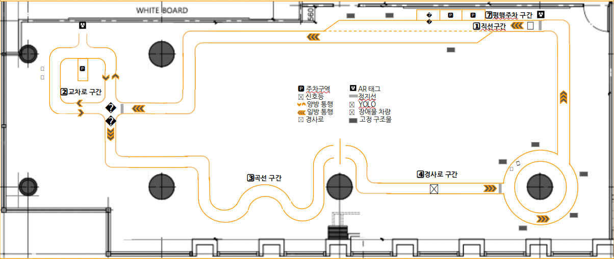
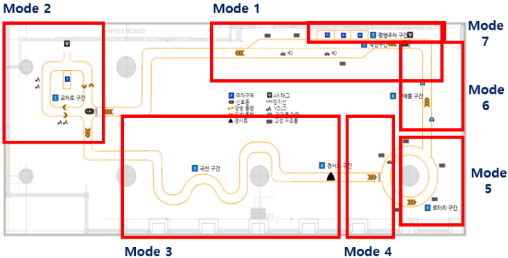

# Programmers Autonomous-Driving Dev School. Final Course Competition

## Video
---

## Goal
---
주어진 미션을 수행하며 map 주행  

## Environment
---
- Ubuntu 18.04  
- ROS Melodic  
- Xycar model D  
- Nvidia TX 2  

## Structure
---
~~~
Project2
  └─ src
  │    └─ main_final.py                 # xycar control main code
  │    └─ drive_module.py               # xycar steering, speed control module
  │    └─ image_processing_module.py    # image processing Module
  │    └─ ar_module.py                  # AR tag control module
  │    └─ lidar_module.py               # lidar sensor control module
  │    └─ ultra_module.py               # ultrasonic sensor control module
  │    └─ yolo_module.py                # object detection control module
  └─ launch
        └─ final_project.launch          # xycar control main launch
~~~

## Usage
---
~~~bash
$ roslaunch final_project final_project.launch
~~~

## Procedure
---
### 1. Mode  
  

- mode 1: 차선 주행, 끼어들기 주행  
- mode 2: 정지선 인식, 신호등 인식, T 주차, YOLO Mission  
- mode 3: S자 곡선 주행, 경사로 주행  
- mode 4: 정지선 인식, 로터리 진입 판단  
- mode 5: 로터리 주행  
- mode 6: 장애물 회피 주행  
- mode 7: 정지선 인식, 신호등 인식, 평행 주차  

### 2. Change mode  
- mode 1: default  
- mode 2: 끼어들기 후, 한쪽 차선을 잃어버려서 회전 구간으로 판단하면 모드 2로 변경  
- mode 3: YOLO Mission을 수행한 후, 한쪽 차선을 잃어버려서 회전 구간으로 판단할 때 모드 3으로 변경  
- mode 4: 경사로를 검출하면 모드 4로 변경  
- mode 5: 정지선에서 멈춘 후, 왼쪽에 차량이 없다고 판단되면 모드 5로 변경  
- mode 6: 로터리 회전 중 상자 검출 시 모드 6 변경
- mode 7: 평행 주차를 위한 AR tag의 거리 조건으로 모드 7 변경  

### 3. Lane Detection

#### Process  
① Calibration  
② ROI 설정  
③ Grayscale  
④ Gaussian Blur  
⑤ Canny Edge Detecion  
⑥ Hough Transform으로 후보 Line 선정  
⑦ 양쪽 차선 모두 검출되었으면 오른쪽 차선 기준으로 주행  
⑧ 왼쪽 차선만 검출되었다면 왼쪽 차선 기준으로 주행  
⑨ 오른쪽 차선만 검출되었다면 오른쪽 차선 기준으로 주행  
⑩ 양쪽 차선이 검출되지 않았다면 우회전  
⑪ PID Control을 통한 최종 Steering 제어  

#### Problems
① 노이즈로 인해서 차선 인식이 불안함  
② 코너 구간에서 한쪽 차선 잃어버리기  
③ 교차로 구간에서 양쪽 차선 잃어버리기  
④ 코너 또는 교차로 구간 끝나고 차선이 합쳐지는 경우  
⑤ 조향각 제어 불안정

#### Resolution
① 차선 인식 범위를 이전 차선 인식 위치를 기준으로 하고, 이전에 차선을 잃어버렸을 경우엔 전 범위 탐색  
② 코너 구간에서는 인식하는 도로폭이 넓어지는 특성을 이용하여 잃어버린 차선을 알맞게 추정  
③ 교차로에서 양쪽 차선을 잃어버리는데, 잃어버렸을 경우 이동하고자 하는 방향으로 차선이 다시 보일 때까지 회전하는 것으로 해결  
④ 양쪽 차선이 보일 때도 한쪽 차선을 이용하여 주행하도록 하여 자연스럽게 차선 변경이 가능하도록 유도  
⑤ 조향을 위한 Offset 최적화 작업을 진행하고, pd 제어로 안정적인 조향각 제어

### 4. Recognition traffic light
  

#### Process  
① Calibration  
② ROI 설정  
③ Gaussian Blur  
④ HSV 채널로 Split  
⑤ 첫번째 신호등과 두번째 신호등에 맞게 cv2.HoughCircles 함수로 원 검출  
⑥ 검출된 원의 개수가 3개 이상 검출되었을 때의 조건 설정  
⑦ 검출된 원들이 모여있는지 조건 설정  
⑧ 검출된 원들 중 가장 오른쪽 원을 초록불로 지정  
⑨ 초록불의 중심 V 값을 기준으로 ON / OFF 판단  

#### Problems
① YOLO로 신호등을 검출하려고 했지만 실제 신호등이 아닌 모형 신호등이여서 검출되지 않음  
② 첫 번째 신호등과 두 번째 신호등의 인식 위치가 다름  
③ 초록불 판단(RGB로 인식 시 불이 켜졌을 때 너무 밝아서 초록색으로 인식하지 못함)  
④ 초록불의 ON/OFF 판단  

#### Resolution
① 신호등 판단 영역을 ROI로 설정한 후 원 검출로 신호등 판단  
② 첫 번째 신호등과 두 번째 신호등의 원 검출 파라미터를 다르게 부여  
③ 원 검출이 3개 이상일 때의 조건을 주고, 가장 왼쪽 원과 가장 오른쪽 원의 차이, 가장 위쪽 원과 가장 아래 쪽 원의 차이의 조건 설정한 후, 가장 오른쪽 원을 초록색으로 판단  
④ HSV 채널 중 V 값을 사용해서 특정값 이상일 때 불이 켜졌다고 판단

### 5. Lane Barge
  

#### Process  
① 차선 폭이 좁아지는 지점을 끼어들기 구간으로 판단  
② 끼어들기 구간에 도착하면 좌측 전면 라이다와 좌측 후면 초음파로 주변 차량 판단 후 진입  

#### Problems
① 끼어들기 시점 결정 및 판단  
② 좁아지는 차선을 따라 꺾기 전에 멈추면 제동거리가 있어서 제동 후에는 차선을 잃어버리는 문제  
③ 꺾다가 멈추면 옆 차선을 침범하여 충돌 위험  

#### Resolution
① 차선이 좁아져서 자연스럽게 차선 변경을 해야하는 시점에 인식한 차선 폭이 좁아지는 특성과 두 차량 사이에 끼어 들어야 하는 미션 조건이 있어서 라이다를 활용해서 좌전방에 차량이 지나간다고 판단되면 진행하는 방법을 사용  
②, ③ 속도를 줄여 제동걸이를 줄이는 동시에 옆 차선을 침법하지 않을 정도로만 좁아지는 차선에 따라 꺾고 멈추도록 조정

### 6. Recognition stop line
  

#### Process  
① 차선을 기준으로 ROI 설정  
② 이진화(밝은 부분을 0)  
③ cv2.countNonZero 함수를 사용해서 0 개수 파악 후, 정지선 인식  

#### Problems
① 각 정지선마다 cv2.countNonZero의 리턴값의 비율이 다름  
② 속도가 빠르면 정지선을 인식하지 못하고 지나침  
③ 장애물 회피 주행 이후 마지막 인식 때, 좌회전 후 정지선이 대각선으로 인식  

#### Resolution
① 정지선을 판단하는 ROI를 고정시키지 않고, 양쪽 차선을 ROI 영역으로 설정  
② 정지선을 판단하기 전 좌회전 혹은 우회전을 파악해서 속도를 미리 줄임  
③ cv2.counNonZero()의 리턴값을 count해서 일정 비율 이상일 시, 정지선으로 인식  

### 7. T parking
  

#### Process  
① AR tag와의 distance를 기준으로 시작 위치 파악  
② 시작 위치에서 AR tag와의 arctan를 기준으로 후진 주차

#### Problems
① 주차를 시작할 때 차선 침범  
② 후진할 때 모터 출력 상태에 따라서 조향각이 달라짐  
③ 주차 완료 후, 너무 가까워서 Yolo 미션 이미지 인식률 저하

#### Resolution
① 일정 거리 동안 직진하게 해서 차선을 침범하지 않도록 설정  
② 주차를 시작하기 전에 차량과 AR 태그의 arctan를 계산해서 조향각 설정  
③ 주차 완료 후, 넓은 범위로 주차 구역을 빠져 나온 후, 여러번 각도 조절로 인한 차선 인식률과 이미지 인식률 높임  

### 8. YOLO Mission
  

#### Process  
① YOLO v2 voc 모델을 사용해서 'person' class 검출  
② 'person' class의 크기를 판단해서 정지 후 검출할 class를 'cat'으로 변경  
③ 'cat' class의 크기를 판단해서 정지  

#### Problems
① Mission이 target 이미지를 지나고 target 이미지가 보이지 않는 부분에서 정지해야 함  
② target 이미지마다 검출된 bounding box의 길이가 다름  
③ 미션 구간에서 정지 한 후, 다시 주행할 때 차선을 잃어버림  

#### Resolution
① YOLO에서 검출된 bounding box의 길이(xmin, xmax) 차이가 일정 크기 이상일 때 일정 거리 주행 후 주차  
② target 이미지마다 일정 거리 주행을 시작하는 bounding box의 일정 크기를 다르게 지정  
③ 정지할 때도 차선을 인식할 수 있도록 정지 코드를 시간 사용에서 count 사용으로 변경  

### 9. Driving on a ramp  
  

#### Process  
① 특정 범위를 ROI로 선정  
② cv2.countNonZero 함수를 이용해서 경사로 인식  
③ 경사로일때 속도를 높여서 오르막길 주행  
④ 내리막길일때 정지해서 정지선을 넘어가지 않도록 주행  

#### Problems
① 경사로를 잘 인식하지 못함  
② 오르막길에서 속도를 올리면 내리막길에서 매우 빨라짐
③ 오르막길에서 차선을 잃어버림  

#### Resolution
① 경사로 진입 전 속도 조절  
② 내리막길에서 일시적으로 후진 주행  
③ 경사로 진입 시 고정 Steering 값으로 주행  

### 10. Driving rotary
  

#### Process  
① 좌측 전면 라이다 센서로 주행 중인 차량 판단  
② 전면 라이다로 로터리에서 먼저 주행 중인 차량과 충돌 방지  
③ 초음파 센서로 우측 상자 인식 후 로터리 주행 종료

#### Problems
① 로터리 진입 판단  
② 로터리 진행 시 충돌 방지  

#### Resolution
① 로터리 전 정지선에서 정지 후, 좌전방에 근접한 차량이 없으면 로터리 진입  
② 진행 중에 속도 차이로 충돌할 수 있으므로 일정 거리 내에 근접 시 정리

### 11. Obstacle avoidance driving
  

#### Process  
① 기본적 차량 주행  
② YOLO로 갓길 주차되어 있는 차량 검출  
③ 차량이 검출된다면 차선 위치 조정해서 주행  

#### Problems
① 장애물 차량이 xycar의 라이다 센서보다 낮아서 인식하기 어려움  
② xycar의 크기 때문에 장애물 차량과 스치면서 주행

#### Resolution
① YOLO를 사용해서 Car 검출한 후, Bounding box의 edge로 장애물 차량 판단 및 차선 위치 재설정  
② Bounding box가 생길 때마다 edge 위치에 가중치 값을 더해줌  

### 12. Parallel parking
  

#### Process  
① Bird's eyes view 형태로 원근 변환  
② Grayscale  
③ 이진화  
④ ROI 설정(화면의 오른쪽 부분)  
⑤ cv2.countNonZero 함수로 주차 판단 구역까지 이동  
⑥ 주차 판단 구역에서 우측 초음파 센서를 이용해서 주차 판단  
⑦ 평행 주차 실행  

#### Problems
① 오른쪽 차선과 주차선이 겹쳐서 주차 판단 구역 인식 불안정  
② 주차 판단 구역에서 빈 주차 자리 인식

#### Resolution
① ROI 영역을 오른쪽 차선까지 포함시키고 cv2.countNonZero 함수에서 파라미터 조절  
② Xycar model D에는 라이다 센서가 앞쪽에 있기 때문에
빈 주차 자리 인식이 어렵다고 판단하여 우측 초음파 센서로 인식
